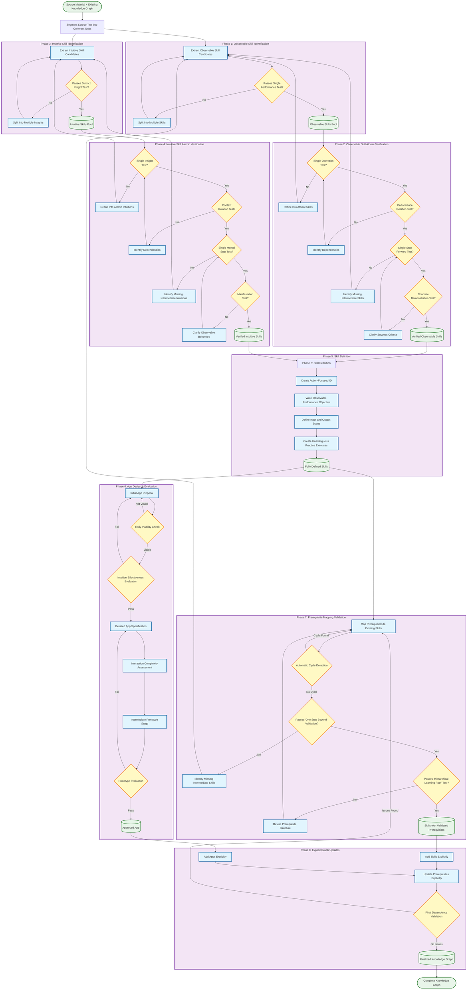

```mermaid
flowchart TD
    Start([Source Material + Existing Knowledge Graph]) --> Segment[Segment Source Text into Coherent Units]
    Segment --> ObservableSkills[Extract Observable Skill Candidates]
    Segment --> IntuitiveSkills[Extract Intuitive Skill Candidates]

    subgraph phase1[Phase 1: Observable Skill Identification]
        ObservableSkills --> ObsPerformanceTest{Passes Single\nPerformance Test?}
        ObsPerformanceTest -->|No| ObsSplit[Split into Multiple Skills]
        ObsSplit --> ObservableSkills
        ObsPerformanceTest -->|Yes| ObsSkillPool[(Observable Skills Pool)]
    end

    subgraph phase2[Phase 2: Observable Skill Atomic Verification]
        ObsSkillPool --> ObsSingleOp{Single Operation\nTest?}
        ObsSingleOp -->|No| ObsRefine1[Refine Into Atomic Skills]
        ObsRefine1 --> ObservableSkills
        
        ObsSingleOp -->|Yes| ObsIsolation{Performance\nIsolation Test?}
        ObsIsolation -->|No| ObsRefine2[Identify Dependencies]
        ObsRefine2 --> ObsSingleOp
        
        ObsIsolation -->|Yes| ObsStepForward{Single Step\nForward Test?}
        ObsStepForward -->|No| ObsRefine3[Identify Missing Intermediate Skills]
        ObsRefine3 --> ObservableSkills
        
        ObsStepForward -->|Yes| ObsDemonstration{Concrete\nDemonstration Test?}
        ObsDemonstration -->|No| ObsRefine4[Clarify Success Criteria]
        ObsRefine4 --> ObsStepForward
        
        ObsDemonstration -->|Yes| VerifiedObservable[(Verified Observable Skills)]
    end

    subgraph phase3[Phase 3: Intuitive Skill Identification]
        IntuitiveSkills --> IntDistinctInsight{Passes Distinct\nInsight Test?}
        IntDistinctInsight -->|No| IntSplit[Split into Multiple Insights]
        IntSplit --> IntuitiveSkills
        IntDistinctInsight -->|Yes| IntSkillPool[(Intuitive Skills Pool)]
    end

    subgraph phase4[Phase 4: Intuitive Skill Atomic Verification]
        IntSkillPool --> IntSingleInsight{Single Insight\nTest?}
        IntSingleInsight -->|No| IntRefine1[Refine Into Atomic Intuitions]
        IntRefine1 --> IntuitiveSkills
        
        IntSingleInsight -->|Yes| IntContextIsolation{Context\nIsolation Test?}
        IntContextIsolation -->|No| IntRefine2[Identify Dependencies]
        IntRefine2 --> IntSingleInsight
        
        IntContextIsolation -->|Yes| IntMentalStep{Single Mental\nStep Test?}
        IntMentalStep -->|No| IntRefine3[Identify Missing Intermediate Intuitions]
        IntRefine3 --> IntuitiveSkills
        
        IntMentalStep -->|Yes| IntManifestation{Manifestation\nTest?}
        IntManifestation -->|No| IntRefine4[Clarify Observable Behaviors]
        IntRefine4 --> IntMentalStep
        
        IntManifestation -->|Yes| VerifiedIntuitive[(Verified Intuitive Skills)]
    end

    VerifiedObservable --> SkillDefinition[Phase 5: Skill Definition]
    VerifiedIntuitive --> SkillDefinition

    subgraph phase5[Phase 5: Skill Definition]
        SkillDefinition --> CreateID[Create Action-Focused ID]
        CreateID --> WriteObjective[Write Observable Performance Objective]
        WriteObjective --> DefineStates[Define Input and Output States]
        DefineStates --> CreateExercises[Create Unambiguous Practice Exercises]
        CreateExercises --> DefinedSkills[(Fully Defined Skills)]
    end

    DefinedSkills --> PrerequisiteMapping[Map Prerequisites to Existing Skills]
    DefinedSkills --> AppInitialProposal[Initial App Proposal]

    subgraph phase6[Phase 6: App Design & Evaluation]
        AppInitialProposal --> ViabilityCheck{Early Viability Check}
        ViabilityCheck -->|Not Viable| AppInitialProposal
        ViabilityCheck -->|Viable| IntuitionEval{Intuition Effectiveness Evaluation}
        IntuitionEval -->|Fail| AppInitialProposal
        IntuitionEval -->|Pass| DetailedAppSpec[Detailed App Specification]
        DetailedAppSpec --> InteractionComplexity[Interaction Complexity Assessment]
        InteractionComplexity --> IntermediatePrototype[Intermediate Prototype Stage]
        IntermediatePrototype --> PrototypeEval{Prototype Evaluation}
        PrototypeEval -->|Fail| DetailedAppSpec
        PrototypeEval -->|Pass| AppApproved[(Approved App)]
    end

    subgraph phase7[Phase 7: Prerequisite Mapping Validation]
        PrerequisiteMapping --> CycleCheck{Automatic Cycle Detection}
        CycleCheck -->|Cycle Found| PrerequisiteMapping
        CycleCheck -->|No Cycle| OneStepValidation{Passes 'One Step Beyond' Validation?}
        OneStepValidation -->|No| FindIntermediate[Identify Missing Intermediate Skills]
        FindIntermediate --> ObservableSkills
        
        OneStepValidation -->|Yes| HierarchicalValidation{Passes 'Hierarchical Learning Path' Test?}
        HierarchicalValidation -->|No| ReviseGraph[Revise Prerequisite Structure]
        ReviseGraph --> PrerequisiteMapping
        
        HierarchicalValidation -->|Yes| ValidatedPrereqs[(Skills with Validated Prerequisites)]
    end

    subgraph phase8[Phase 8: Explicit Graph Updates]
        ValidatedPrereqs --> AddSkills[Add Skills Explicitly]
        AppApproved --> AddApps[Add Apps Explicitly]
        AddSkills --> UpdatePrereqs[Update Prerequisites Explicitly]
        AddApps --> UpdatePrereqs
        UpdatePrereqs --> FinalDependencyCheck{Final Dependency Validation}
        FinalDependencyCheck -->|Issues Found| PrerequisiteMapping
        FinalDependencyCheck -->|No Issues| FinalizedGraph[(Finalized Knowledge Graph)]
    end

    FinalizedGraph --> End([Complete Knowledge Graph])

    classDef process fill:#e1f5fe,stroke:#01579b,stroke-width:2px;
    classDef decision fill:#fff9c4,stroke:#f57f17,stroke-width:2px;
    classDef data fill:#e8f5e9,stroke:#2e7d32,stroke-width:2px;
    classDef phase fill:#f3e5f5,stroke:#6a1b9a,stroke-width:2px;

    class ObservableSkills,ObsSplit,ObsRefine1,ObsRefine2,ObsRefine3,ObsRefine4,IntuitiveSkills,IntSplit,IntRefine1,IntRefine2,IntRefine3,IntRefine4,CreateID,WriteObjective,DefineStates,CreateExercises,PrerequisiteMapping,FindIntermediate,ReviseGraph,AppInitialProposal,DetailedAppSpec,InteractionComplexity,IntermediatePrototype,AddSkills,AddApps,UpdatePrereqs process;
    class ObsPerformanceTest,ObsSingleOp,ObsIsolation,ObsStepForward,ObsDemonstration,IntDistinctInsight,IntSingleInsight,IntContextIsolation,IntMentalStep,IntManifestation,ViabilityCheck,IntuitionEval,PrototypeEval,CycleCheck,OneStepValidation,HierarchicalValidation,FinalDependencyCheck decision;
    class Start,ObsSkillPool,VerifiedObservable,IntSkillPool,VerifiedIntuitive,DefinedSkills,ValidatedPrereqs,AppApproved,FinalizedGraph,End data;
    class phase1,phase2,phase3,phase4,phase5,phase6,phase7,phase8 phase;
```
